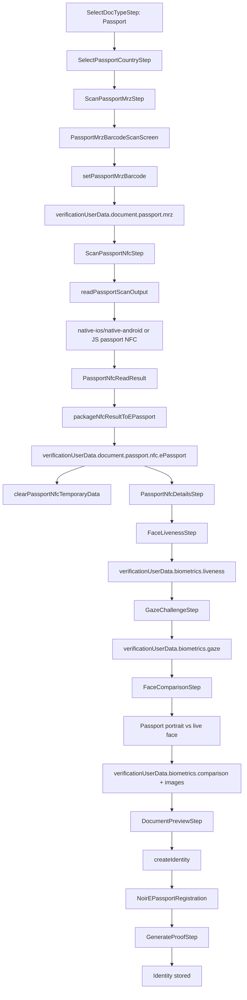
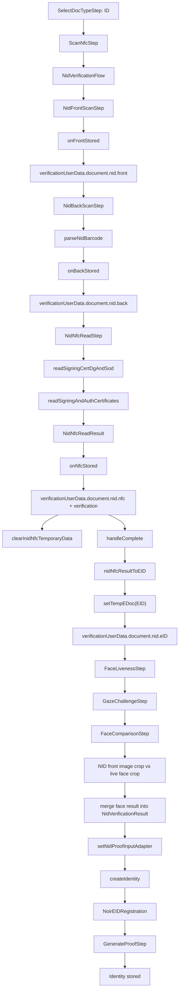

# Jomhoor App: Verification Data Flow Audit

- **Date:** May 30, 2026
- **Scope:** Passport and Iranian NID verification flows
- **Status:** Updated to match current code after verificationUserData Phase 3 and NID proof handoff work

---

## Executive Summary

The document verification flow now uses `verificationUserData` in `ScanProvider` as the canonical per-session verification object. Legacy state variables still exist as compatibility fallbacks, but new writes are copied into `verificationUserData` first and many older transient states are cleared immediately after canonical storage.

Current supported flows:

1. **Passport verification**: country selection, MRZ/barcode scan, NFC read, liveness, gaze, face comparison, document preview, Noir proof generation.
2. **NID verification**: front image capture, back barcode scan, live NFC certificate read, liveness, gaze, face comparison against the NID front image, `EID` adapter creation, Noir EID proof generation.

Key current facts:

- `verificationUserData.document.passport` stores passport MRZ/barcode/NFC output, including `EPassport` for proof generation.
- `verificationUserData.document.nid` stores NID front/back/NFC output, final verification result, proof adapter data, and the generated `EID` object used by Noir EID proof generation.
- NID proof generation now uses the real `createIdentity()` path, not `runMockNidProofGeneration()` after face comparison succeeds.
- NID NFC currently reads signing/auth certificate hex. `dg1Bytes`, `dg15Bytes`, and `sodBytes` are typed and carried if available, but real APDU extraction for those DG/SOD files is not implemented yet.
- Passport native NFC modules now expose `clearTemporaryData()`; JS falls back to session cancel/disconnect when unavailable.
- NID NFC cleanup runs through `clearInidNfcTemporaryData()` after NID NFC data is stored.

---

## Canonical Session Object

`verificationUserData` is defined in `src/pages/app/pages/document-scan/ScanProvider/index.tsx`.

Current shape, simplified:

```ts
VerificationUserData = {
  session: {
    id: string
    startedAt: number
    docType?: DocType
    selectedPassportCountry?: string
    status: 'collecting' | 'ready-for-proof' | 'proofing' | 'completed' | 'cancelled' | 'failed'
  }
  document: {
    passport: {
      mrz?: {
        fields?: FieldRecords
        credentials?: PassportCredentials
        rawBarcode?: string
        parsedBarcode?: { raw?: string; nidn?: string; fields?: Record<string, unknown> }
      }
      nfc?: {
        normalized?: PassportNfcScanOutput['normalized']
        files?: PassportNfcReadResult['files']
        packageNfcResult?: PassportNfcReadResult
        portrait?: { base64?: string; filePath?: string }
        ePassport?: EPassport
        backend?: PassportNfcReadResult['backend']
        finalStatus?: PassportNfcReadResult['finalStatus']
        nativeSessionId?: string
      }
    }
    nid: {
      front?: { imageUri?: string; capturedAt?: number }
      back?: {
        barcodeRaw?: string
        barcode?: NidVerificationResult['back']['barcode']
        nationalId?: string
      }
      nfc?: NidVerificationResult['nfc'] & { nativeSessionId?: string }
      eID?: EID
      verification?: NidVerificationResult
      proofInput?: NidProofInputAdapterData
    }
  }
  biometrics: {
    liveness?: LivenessResult
    gaze?: GazeChallengeResult
    comparison?: FaceComparisonResult
    images?: {
      referenceUri?: string
      liveCaptureUri?: string
      referenceCropUri?: string
      liveCropUri?: string
    }
  }
  proof: {
    creatingIdentityStep?: GenProofSteps
    identity?: IdentityItem
    error?: { code?: string; message: string }
  }
  evidence: VerificationEvidenceRecord[]
}
```

`evidence` records store the step, source, timestamp, and keys written. They are diagnostic metadata only and should not contain raw personal data.

---

## Current Passport Flow



### Passport Write Points

| Step                       | Code                                                 | Canonical write                                                    |
| -------------------------- | ---------------------------------------------------- | ------------------------------------------------------------------ |
| Document type              | `handleSetSelectedDocType()`                         | `session.docType`                                                  |
| Country                    | `handleSetPassportCountryCode()`                     | `session.selectedPassportCountry`                                  |
| MRZ fields                 | `handleSetMrz()`                                     | `document.passport.mrz.fields`                                     |
| MRZ/barcode package result | `handleSetPassportMrzBarcode()`                      | `document.passport.mrz.credentials`, `parsedBarcode`, `rawBarcode` |
| NFC result                 | `handleSetPassportNfcScanOutput()`                   | `document.passport.nfc.*`, including `ePassport`                   |
| NFC display details        | `handleSetPassportNfcDetails()`                      | `document.passport.nfc.normalized`, `portrait`, `packageNfcResult` |
| Liveness                   | `setFaceLivenessResult()`                            | `biometrics.liveness`                                              |
| Gaze                       | `setFaceGazeResult()`                                | `biometrics.gaze`                                                  |
| Face comparison            | `setFaceComparisonResult()` and `FaceComparisonStep` | `biometrics.comparison`, `biometrics.images`                       |
| Proof completion           | `createIdentity()`                                   | `proof.identity`, `proof.creatingIdentityStep`, `session.status`   |

### Passport Proof Input

`createIdentity()` resolves the document for passport proof as:

```ts
proofEDoc = tempEDoc ?? verificationUserData.document.passport.nfc?.ePassport
```

The proof generator receives an `EPassport` containing:

- `personDetails`
- `sodBytes`
- `dg1Bytes`
- optional `dg15Bytes`
- optional `dg11Bytes`
- optional `aaSignature`

The proof strategy is `NoirEPassportRegistration`, which builds a `NoirEPassportBasedRegistrationCircuit`.

---

## Current NID Flow



### NID Write Points

| Step              | Code                                               | Canonical write                                                                   |
| ----------------- | -------------------------------------------------- | --------------------------------------------------------------------------------- |
| Front image       | `ScanNfcStep.handleFrontStored()`                  | `document.nid.front.imageUri`, `capturedAt`                                       |
| Back barcode      | `ScanNfcStep.handleBackStored()`                   | `document.nid.back.barcodeRaw`, `barcode`, `nationalId`                           |
| NFC read          | `ScanNfcStep.handleNfcStored()`                    | `document.nid.nfc`, `document.nid.verification`, `session.status`                 |
| EID adapter       | `ScanNfcStep.handleComplete()` + `setTempEDoc()`   | `document.nid.eID`                                                                |
| Liveness          | `setFaceLivenessResult()`                          | `biometrics.liveness`                                                             |
| Gaze              | `setFaceGazeResult()`                              | `biometrics.gaze`                                                                 |
| Face comparison   | `FaceComparisonStep` + `setFaceComparisonResult()` | `biometrics.comparison`, `biometrics.images`, updated `document.nid.verification` |
| NID proof adapter | `setNidProofInputAdapter()`                        | `document.nid.proofInput`, `proof.creatingIdentityStep`, `session.status`         |
| Proof completion  | `createIdentity()`                                 | `proof.identity`, `proof.creatingIdentityStep`, `session.status`                  |

### NID Proof Input

`createIdentity()` resolves the document for NID proof as:

```ts
proofEDoc = tempEDoc ?? verificationUserData.document.nid.eID
```

`nidNfcResultToEID()` converts `NidNfcReadResult` into an `EID` by parsing:

- `signingCertHex` -> `EID.sigCertificate`
- `authCertHex` -> `EID.authCertificate`

The proof strategy is `NoirEIDRegistration`, which uses `NoirEIDBasedRegistrationCircuit`.

Current Noir EID proof circuit requires:

- signing certificate TBS bytes, derived from `EID.sigCertificate`
- authentication certificate public key, derived from `EID.authCertificate`
- signing certificate signature, derived from `EID.sigCertificate`
- ICAO/Rarimo SMT root and siblings, fetched in `NoirEIDRegistration`
- wallet private key, from wallet store

### NID DG/SOD Status

`NidNfcReadResult` now supports optional:

- `dg1Bytes`
- `dg15Bytes`
- `sodBytes`

`NidProofInputAdapterData.nfcArtifacts` also carries those fields if present.

However, `readSigningCertDgAndSod()` currently wraps `readSigningAndAuthCertificates()` and does not yet perform real DG/SOD APDU reads. The current real proof path is certificate-based, matching the current Noir EID circuit. DG/SOD extraction remains a future NFC reader enhancement.

---

## Data Categories Inventory

### Document Images

| Data              | Source                                          | Current storage                                                                                      | Persistence                                    | Cleanup                                                                                           | Risk   |
| ----------------- | ----------------------------------------------- | ---------------------------------------------------------------------------------------------------- | ---------------------------------------------- | ------------------------------------------------------------------------------------------------- | ------ |
| NID front image   | `NidFrontScanStep` camera/capture UI            | `verificationUserData.document.nid.front.imageUri`                                                   | Per session                                    | Reset on new doc type/session; not file-deleted here                                              | Medium |
| NID back image    | Not currently stored as image in canonical flow | N/A                                                                                                  | N/A                                            | N/A                                                                                               | Low    |
| Passport portrait | NFC DG2/native output                           | `verificationUserData.document.passport.nfc.portrait` and `EPassport.personDetails.passportImageRaw` | Session and persisted inside identity document | Revocation/identity removal                                                                       | Medium |
| Live face capture | Vision Camera photo                             | `verificationUserData.biometrics.images.liveCaptureUri`                                              | Per session file URI                           | Not explicitly deleted in app step                                                                | High   |
| Face crops        | `getCenteredFaceSquareCrop()`                   | `verificationUserData.biometrics.images.referenceCropUri/liveCropUri`                                | Per session file URI                           | Package cleanup exists for internal prepared images; app-held crop URI cleanup needs verification | Medium |

### MRZ and Barcode Data

| Data                          | Source                  | Current storage                                                                                                          | Persistence                            | Cleanup                    | Risk   |
| ----------------------------- | ----------------------- | ------------------------------------------------------------------------------------------------------------------------ | -------------------------------------- | -------------------------- | ------ |
| Passport MRZ fields           | MRZ/barcode scan        | `verificationUserData.document.passport.mrz.fields`                                                                      | Per session                            | New session/doc type reset | Medium |
| Passport credentials          | MRZ parse               | `verificationUserData.document.passport.mrz.credentials`                                                                 | Per session, then identity proof input | New session/doc type reset | Medium |
| Passport barcode payload/NIDN | Barcode parser          | `verificationUserData.document.passport.mrz.parsedBarcode/rawBarcode`                                                    | Per session                            | New session/doc type reset | Medium |
| NID back barcode payload      | NID barcode scan        | `verificationUserData.document.nid.back.barcodeRaw/barcode`                                                              | Per session                            | New session/doc type reset | Medium |
| NID national ID               | NID barcode/NFC derived | `verificationUserData.document.nid.back.nationalId`, `document.nid.nfc.nationalId`, `document.nid.verification.identity` | Per session and proof input            | New session/doc type reset | High   |

### NFC Data

| Data                           | Source               | Current storage                                                                     | Persistence                                          | Cleanup                                                                                         | Risk             |
| ------------------------------ | -------------------- | ----------------------------------------------------------------------------------- | ---------------------------------------------------- | ----------------------------------------------------------------------------------------------- | ---------------- |
| Passport DG1/DG15/SOD files    | Passport NFC         | `verificationUserData.document.passport.nfc.files`, `packageNfcResult`, `ePassport` | Per session, then persisted in identity document     | Native `clearTemporaryData()` after read; identity persists until removal/revocation            | Medium           |
| Passport DG2 portrait          | Passport NFC         | `portrait`, `EPassport.personDetails.passportImageRaw`                              | Per session and persisted in identity document       | Native temp cleanup; identity persists                                                          | Medium           |
| Passport BAC/session internals | Native/JS NFC reader | Native/JS memory                                                                    | During read                                          | `clearPassportNfcTemporaryData()` / cancel                                                      | High during read |
| NID signing cert               | NID NFC APDU         | `verificationUserData.document.nid.nfc.signingCertHex`, `EID.sigCertificate`        | Per session, then persisted in EID identity document | `clearInidNfcTemporaryData()` clears NFC session only; canonical data remains until session end | Medium           |
| NID auth cert                  | NID NFC APDU         | `verificationUserData.document.nid.nfc.authCertHex`, `EID.authCertificate`          | Per session, then persisted in EID identity document | Same as signing cert                                                                            | Medium           |
| NID DG1/DG15/SOD               | Future NID APDU read | Optional fields in `NidNfcReadResult`                                               | Not currently populated                              | N/A                                                                                             | Medium           |

### Biometrics

| Data                          | Source                        | Current storage                              | Persistence | Cleanup                                                        | Risk   |
| ----------------------------- | ----------------------------- | -------------------------------------------- | ----------- | -------------------------------------------------------------- | ------ |
| Liveness result               | Face detector/challenge logic | `verificationUserData.biometrics.liveness`   | Per session | `resetFaceVerification()` clears biometrics                    | Low    |
| Gaze result                   | Gaze challenge                | `verificationUserData.biometrics.gaze`       | Per session | `resetFaceVerification()` clears biometrics                    | Low    |
| Face comparison result        | `compareFaces()`              | `verificationUserData.biometrics.comparison` | Per session | `resetFaceVerification()` clears biometrics                    | Medium |
| Live/reference image URI refs | Camera/crop utilities         | `verificationUserData.biometrics.images`     | Per session | Reset clears references only; file deletion needs verification | High   |

### Proof and Identity Data

| Data                   | Source                           | Current storage                                | Persistence                              | Cleanup                     | Risk     |
| ---------------------- | -------------------------------- | ---------------------------------------------- | ---------------------------------------- | --------------------------- | -------- |
| Passport proof input   | `EPassport` + wallet private key | In memory during `createIdentity()`            | Proof stored in `IdentityItem`           | Identity removal/revocation | High     |
| NID proof input        | `EID` + wallet private key       | In memory during `createIdentity()`            | Proof stored in `IdentityItem`           | Identity removal/revocation | High     |
| NID debug adapter data | `toNidProofInputAdapterData()`   | `verificationUserData.document.nid.proofInput` | Per session                              | New session/doc type reset  | Medium   |
| Generated proof        | Noir circuit                     | `IdentityItem.registrationProof`               | Secure store and blockchain registration | Identity removal/revocation | High     |
| Identity document      | `EPassport` or `EID`             | `IdentityItem.document`                        | Secure store                             | Identity removal/revocation | Critical |
| Wallet private key     | Wallet store                     | Wallet module state / secure storage           | Long-lived                               | Wallet lifecycle            | Critical |

---

## Native and Cleanup Hooks

### Passport NFC

Code paths:

- JS facade: `src/utils/e-document/passport-nfc-reader.ts`
- Package runtime: `packages/passport-verification/src/passport/nfc/runtime.ts`
- Native bridge loader: `packages/passport-verification/src/shared/native/passport-native-module.ts`
- iOS native module: `packages/passport-verification/ios/PassportVerificationModule.swift`
- Android native module: `packages/passport-verification/android/src/main/java/com/iland/passportverification/PassportVerificationModule.kt`

Current cleanup behavior:

- `clearPassportNfcTemporaryData()` calls package/native cleanup where available.
- Native modules expose `clearTemporaryData()`.
- TS bridge falls back to `cancelSession()`/`disconnect()` when `clearTemporaryData()` is unavailable.
- `ScanPassportNfcStep` calls cleanup after `setPassportNfcScanOutput(passportOutput)`.

### NID NFC

Code paths:

- `src/utils/e-document/inid-nfc-reader.ts`
- `src/pages/app/pages/document-scan/components/ScanNfcStep.tsx`

Current cleanup behavior:

- `clearInidNfcTemporaryData()` cancels the active technology request and closes NFC manager.
- `ScanNfcStep.handleNfcStored()` calls cleanup after storing NID NFC data in `verificationUserData`.
- This clears native/session state, not canonical verification data needed for proof generation.

---

## Proof Generator Handoff

### Passport

`DocumentPreviewStep` calls `createIdentity()`.

`createIdentity()` selects:

```ts
const strategy = selectedDocType === DocType.PASSPORT ? epassportRegistration : eidRegistration
```

For passport, it passes the `EPassport` from `verificationUserData.document.passport.nfc.ePassport` if the legacy `tempEDoc` has been cleared.

### NID

After NID face comparison succeeds:

1. `FaceComparisonStep` merges face results into `NidVerificationResult`.
2. `setNidVerificationResult()` stores the merged result in `verificationUserData.document.nid.verification`.
3. `setNidProofInputAdapter()` stores debug/proof handoff data in `verificationUserData.document.nid.proofInput`.
4. `createIdentity()` runs the real Noir EID registration strategy.
5. `createIdentity()` passes `verificationUserData.document.nid.eID` to `NoirEIDRegistration`.

`GenerateProofStep` displays progress from `creatingIdentityStep` and reads NID adapter mode from either legacy `nidProofInputAdapter` or `verificationUserData.document.nid.proofInput`.

---

## Current Risks and Gaps

### High Priority

1. **Live face capture and crop file cleanup needs verification**
   - The app stores live capture/crop URI references in `verificationUserData.biometrics.images`.
   - The face package performs some temporary-image cleanup internally, but the app-held live capture and preview crop URI lifetime should be verified on device.
   - Add explicit deletion after proof generation/cancel if files are app-owned and no longer needed.

2. **NID DG/SOD APDU extraction is not implemented**
   - Types and adapter handoff can carry DG/SOD bytes.
   - `readSigningCertDgAndSod()` currently returns certificates only.
   - If future circuits require DG1/DG15/SOD, exact Iranian NID EF IDs/APDU sequences must be implemented and tested on physical cards.

3. **Sensitive canonical data remains until session end**
   - This is required for proof generation, but cancellation/unmount cleanup should explicitly reset `verificationUserData` and delete app-owned files.

### Medium Priority

1. **Legacy state still exists**
   - `tempMRZ`, `tempEDoc`, `passportNfcDetails`, `passportMrzBarcode`, `nidVerificationResult`, and `nidProofInputAdapter` still exist for compatibility.
   - Current code writes canonical data first and often clears these states, but future code should avoid adding new dependencies on them.

2. **Certificate hex remains in canonical state until reset**
   - NID proof generation needs parsed certificates via `EID`.
   - After `EID` creation, raw cert hex may be redundant for proof generation but is still retained for debugging/handoff.

3. **Diagnostic logging must remain metadata-only**
   - Existing diagnostics generally log presence/length/status, not raw bytes.
   - Avoid adding logs for national ID, names, cert hex, DG bytes, image URIs, or proof inputs.

---

## Testing Checklist

- [ ] Passport happy path still reaches `GenerateProofStep` using `verificationUserData.document.passport.nfc.ePassport` when `tempEDoc` is cleared.
- [ ] NID happy path reaches real `createIdentity()` after face comparison using `verificationUserData.document.nid.eID`.
- [ ] NID with missing signing cert fails at `nidNfcResultToEID()` before face flow.
- [ ] NID with missing auth cert fails at `nidNfcResultToEID()` before face flow.
- [ ] NID with invalid cert hex fails with `NidNfcMappingError`.
- [ ] Back/cancel from each verification step clears or abandons session state as expected.
- [ ] Native passport `clearTemporaryData()` is callable on iOS and Android.
- [ ] NID `clearInidNfcTemporaryData()` closes NFC after a successful read.
- [ ] Face capture/crop files are deleted or confirmed to be package-managed temporary files.
- [ ] `verificationUserData.evidence` records contain only keys/source/step/timestamps, no PII values.
- [ ] `yarn test`, `yarn tsc --noEmit`, and package TS builds pass.

---

## References

- `src/pages/app/pages/document-scan/ScanProvider/index.tsx` - canonical verification context, proof handoff, state adapters
- `src/pages/app/pages/document-scan/components/ScanNfcStep.tsx` - NID front/back/NFC flow host wiring
- `src/pages/app/pages/document-scan/components/ScanPassportNfcStep.tsx` - passport NFC read and cleanup
- `src/pages/app/pages/document-scan/components/FaceComparisonStep.tsx` - shared face comparison and NID proof trigger
- `src/pages/app/pages/document-scan/adapters/nidNfcResultToEID.ts` - NID NFC certificate hex to `EID`
- `src/pages/app/pages/document-scan/adapters/packageNfcResultToEPassport.ts` - passport NFC result to `EPassport`
- `src/utils/e-document/inid-nfc-reader.ts` - Iranian NID NFC APDU helpers
- `src/utils/e-document/passport-nfc-reader.ts` - passport NFC facade and cleanup
- `packages/nid-verification/` - reusable NID verification flow/package
- `packages/passport-verification/` - passport NFC, barcode, liveness, gaze, face comparison package
- `src/api/modules/registration/variants/noir-eid.ts` - Noir EID proof strategy
- `src/api/modules/registration/variants/noir-epassport.ts` - Noir passport proof strategy

---

## Status Legend

| Status      | Meaning                                                                                |
| ----------- | -------------------------------------------------------------------------------------- |
| Implemented | Code exists and is currently wired into the flow                                       |
| Partial     | Code/types exist, but hardware-specific or proof-specific implementation is incomplete |
| Deferred    | Known requirement not implemented in this slice                                        |

- **Audit updated:** 2026-05-30
- **Auditor notes:** This audit reflects the current code flow after introducing canonical `verificationUserData` storage and the NID `EID` proof handoff. Cryptographic correctness, APDU completeness, and production privacy hardening remain separate validation tasks.
