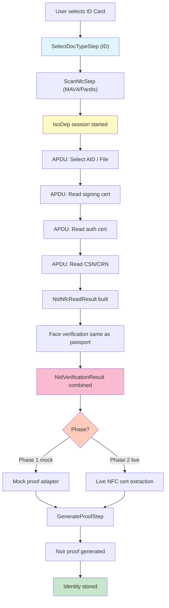
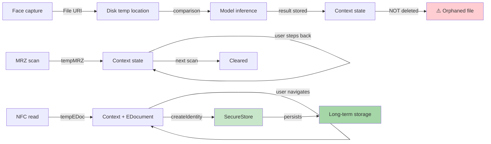

# Jomhoor App: Verification Data Flow Audit

**Date:** May 30, 2026  
**Scope:** Passport/Document verification and NID verification flows  
**Status:** Completed audit covering implemented passport flow and planned NID flow

---

## Executive Summary

The Jomhoor app implements a multi-step identity verification pipeline that collects sensitive biometric and document data through NFC reads, camera captures, and barcode scanning. This audit documents how user verification data is collected, processed, stored, and cleaned up across two verification flows:

1. **Passport/Document Verification** (✅ Implemented) — reads ICAO 9303 passports via NFC + face liveness/comparison
2. **NID Verification** (🔄 Planned/Partial) — reads Iranian National ID cards via NFC + face verification

**Key Findings:**

- Sensitive data (face images, NFC raw bytes, certificates) is held in **React context state** during the flow
- Portrait images are stored **optionally on disk** via file URIs (not base64 in memory)
- Intermediate data is **reset on step transitions** but **persists in state** if the user goes back
- **No explicit cleanup** of camera frames or temporary face crops after comparison
- Certificate/credential data flows into secure storage via **Zustand + expo-secure-store**
- NID flow uses **mock adapters** for phase 1; phase 2 is planned for live NFC integration

---

## Data Categories Inventory

### 1. Document Images

| Data                    | Source             | Storage      | Persistence | Network | Logging    | Lifetime             | Cleanup      | Risk       |
| ----------------------- | ------------------ | ------------ | ----------- | ------- | ---------- | -------------------- | ------------ | ---------- |
| **Front image (NID)**   | Camera via OCR     | Memory (URI) | Per-session | None    | Debug only | Until step reset     | On next scan | **MEDIUM** |
| **Back image (NID)**    | Camera via barcode | Memory (URI) | Per-session | None    | Debug only | Until step reset     | On next scan | **MEDIUM** |
| **MRZ scan (passport)** | Camera barcode     | Memory (URI) | Per-session | No      | Diagnostic | Until barcode parsed | Auto-cleared | **LOW**    |

**Assumptions:** Front/back images for NID are stored as file URIs (paths), not base64 in memory. Full verification of cleanup timing needed.

---

### 2. MRZ Data

| Data                  | Source         | Storage                | Persistence | Network        | Logging           | Lifetime                        | Cleanup               | Risk       |
| --------------------- | -------------- | ---------------------- | ----------- | -------------- | ----------------- | ------------------------------- | --------------------- | ---------- |
| **Parsed MRZ fields** | Barcode reader | Context state          | Per-session | No             | Diagnostic logged | Until manual reset or next scan | Manual reset required | **MEDIUM** |
| **MRZ raw string**    | OCR or barcode | Temp variable          | Per-session | No             | Debug only        | During read op                  | Auto-freed            | **LOW**    |
| **Document number**   | MRZ            | Context + secure store | Persistent  | Via proof data | Diagnostic        | Until revoked                   | On revocation         | **HIGH**   |
| **DOB, expiry**       | MRZ            | Context + secure store | Persistent  | Via proof data | Diagnostic        | Until revoked                   | On revocation         | **MEDIUM** |

**Location:** `ScanProvider.tsx:tempMRZ` state  
**Logged:** `setTempMrz()` at `ScanProvider/index.tsx:532-545`

---

### 3. Barcode Data

| Data                  | Source              | Storage                      | Persistence | Network        | Logging    | Lifetime               | Cleanup              | Risk       |
| --------------------- | ------------------- | ---------------------------- | ----------- | -------------- | ---------- | ---------------------- | -------------------- | ---------- |
| **Barcode raw**       | Camera OCR          | Context state                | Per-session | No             | Diagnostic | Until next scan        | Manual reset         | **MEDIUM** |
| **Parsed barcode**    | `parseNidBarcode()` | Context + state              | Per-session | No             | Diagnostic | Until next scan        | Manual reset         | **MEDIUM** |
| **NIDN from barcode** | Barcode parser      | Context (passportMrzBarcode) | Per-session | Via proof data | Diagnostic | Until identity created | On identity creation | **MEDIUM** |

**Location:** `ScanProvider.tsx:passportMrzBarcode`  
**Parser:** `packages/nid-verification/src/barcode/index.ts`

---

### 4. OCR/Manual Input

| Data                     | Source        | Storage           | Persistence | Network | Logging    | Lifetime            | Cleanup      | Risk       |
| ------------------------ | ------------- | ----------------- | ----------- | ------- | ---------- | ------------------- | ------------ | ---------- |
| **OCR-extracted fields** | Camera vision | Memory (NID flow) | Per-session | No      | Diagnostic | Until step complete | On next scan | **MEDIUM** |
| **Manual entry**         | User keyboard | Memory            | Per-session | No      | Diagnostic | Until step complete | On reset     | **LOW**    |

**NID Flow:** OCR results stored in `NidFrontScanResult` with `NidEvidenceField` (source + confidence)  
**Location:** `packages/nid-verification/src/types/index.ts:16-22`

---

### 5. NFC Raw Data and Parsed Fields

#### NFC Raw Bytes

| Data                        | Source           | Storage                 | Persistence           | Network   | Logging              | Lifetime        | Cleanup       | Risk       |
| --------------------------- | ---------------- | ----------------------- | --------------------- | --------- | -------------------- | --------------- | ------------- | ---------- |
| **NFC session keys (BAC)**  | Derived from MRZ | Memory (crypto context) | None                  | No        | None                 | During NFC read | Auto-freed    | **HIGH**   |
| **DG1 raw bytes**           | NFC chip         | EDocument object        | Persistent (in proof) | Via proof | Diagnostic (summary) | Until revoked   | On revocation | **MEDIUM** |
| **DG2 raw bytes (face)**    | NFC chip         | EDocument object        | Persistent            | Via proof | Diagnostic (summary) | Until revoked   | On revocation | **MEDIUM** |
| **DG15 raw bytes (AA key)** | NFC chip         | EDocument object        | Persistent            | Via proof | Diagnostic (summary) | Until revoked   | On revocation | **LOW**    |
| **SOD bytes (signature)**   | NFC chip         | EDocument object        | Persistent            | Via proof | Diagnostic (summary) | Until revoked   | On revocation | **LOW**    |

**NFC Protocol:** ICAO 9303 Part 11 Basic Access Control (BAC)  
**Implementation:** `src/utils/e-document/passport-nfc-reader.ts:49-150` (crypto operations)

#### NFC Parsed Fields

| Data                           | Source        | Storage            | Persistence | Network | Logging            | Lifetime               | Cleanup                  | Risk       |
| ------------------------------ | ------------- | ------------------ | ----------- | ------- | ------------------ | ---------------------- | ------------------------ | ---------- |
| **Normalized passport fields** | NFC DG1 parse | Context state      | Per-session | No      | Diagnostic         | Until identity created | Auto-cleared on creation | **MEDIUM** |
| **NID fields (from NFC)**      | NFC APDU      | `NidNfcReadResult` | Per-session | No      | Diagnostic + debug | Until identity created | Manual cleanup           | **MEDIUM** |
| **CSN / CRN (card serial)**    | NFC CPLC      | `NidNfcReadResult` | Per-session | No      | Debug              | Until identity created | Manual cleanup           | **LOW**    |

**Passport location:** `ScanProvider.tsx:passportNfcDetails`  
**NID location:** `packages/nid-verification/src/types/index.ts:31-44`

---

### 6. Certificates and Signing Material

| Data                                 | Source   | Storage                           | Persistence | Network           | Logging                 | Lifetime               | Cleanup        | Risk       |
| ------------------------------------ | -------- | --------------------------------- | ----------- | ----------------- | ----------------------- | ---------------------- | -------------- | ---------- |
| **CSCA certificates (passport SOD)** | NFC DG15 | EDocument.sod                     | Persistent  | Via proof circuit | Diagnostic (tree built) | Until revoked          | On revocation  | **MEDIUM** |
| **AA signature**                     | NFC DG15 | EDocument.aaSignature             | Persistent  | Via proof         | Diagnostic              | Until revoked          | On revocation  | **LOW**    |
| **Signing cert (NID)**               | NFC APDU | `NidNfcReadResult.signingCertHex` | Per-session | No                | Debug                   | Until identity created | Manual cleanup | **MEDIUM** |
| **Auth cert (NID)**                  | NFC APDU | `NidNfcReadResult.authCertHex`    | Per-session | No                | Debug                   | Until identity created | Manual cleanup | **MEDIUM** |

**CSCA processing:** `src/api/modules/registration/strategy.ts:1-150` (cert tree building)  
**Certificate extraction:** `src/utils/e-document/inid-nfc-reader.ts:56-80` (APDU commands)

---

### 7. Liveness Result

| Data                             | Source                        | Storage         | Persistence | Network | Logging    | Lifetime                | Cleanup       | Risk    |
| -------------------------------- | ----------------------------- | --------------- | ----------- | ------- | ---------- | ----------------------- | ------------- | ------- |
| **Liveness passed flag**         | Face detector + sequence eval | Context state   | Per-session | No      | Diagnostic | Until face reset        | On face reset | **LOW** |
| **Challenge sequence**           | Pre-computed sequence         | Memory (useRef) | Per-session | No      | None       | Until component unmount | Auto-freed    | **LOW** |
| **Challenge count**              | Sequence evaluator            | Context state   | Per-session | No      | Diagnostic | Until face reset        | On face reset | **LOW** |
| **Started/completed timestamps** | Date.now()                    | LivenessResult  | Per-session | No      | Diagnostic | Until face reset        | On face reset | **LOW** |

**Location:** `src/pages/app/pages/document-scan/components/FaceLivenessStep.tsx:27-50`  
**Logged:** `ScanProvider/index.tsx:694-708`

---

### 8. Gaze Challenge Result

| Data                              | Source                               | Storage       | Persistence | Network | Logging    | Lifetime                | Cleanup       | Risk    |
| --------------------------------- | ------------------------------------ | ------------- | ----------- | ------- | ---------- | ----------------------- | ------------- | ------- |
| **Gaze passed flag**              | Face detector + challenge evaluation | Context state | Per-session | No      | Diagnostic | Until face reset        | On face reset | **LOW** |
| **Challenge targets + responses** | In-memory references                 | useRef        | Per-session | No      | None       | Until component unmount | Auto-freed    | **LOW** |

**Location:** `src/pages/app/pages/document-scan/components/GazeChallengeStep.tsx` (not fully read)

---

### 9. Face Images and Crops

| Data                        | Source                        | Storage               | Persistence | Network   | Logging     | Lifetime                  | Cleanup            | Risk       |
| --------------------------- | ----------------------------- | --------------------- | ----------- | --------- | ----------- | ------------------------- | ------------------ | ---------- |
| **Portrait from NFC (DG2)** | NFC DG2 data                  | Context + file URI    | Persistent  | Via proof | Diagnostic  | Until identity created    | On revocation      | **MEDIUM** |
| **Live face frames**        | Camera frame processor        | Memory (frame buffer) | None        | No        | None        | Single frame              | Auto-freed         | **LOW**    |
| **Captured live face**      | `takeSnapshot()`              | File system URI       | Per-session | No        | Conditional | Until comparison complete | **NOT CLEARED** ⚠️ | **HIGH**   |
| **Face crop (reference)**   | `getCenteredFaceSquareCrop()` | Memory                | Per-session | No        | Debug       | During comparison         | Auto-freed         | **MEDIUM** |
| **Face crop (live)**        | `getCenteredFaceSquareCrop()` | Memory                | Per-session | No        | Debug       | During comparison         | Auto-freed         | **MEDIUM** |

**Portrait handling:** `src/pages/app/pages/document-scan/adapters/extractPackageNfcDisplayDetails.ts:59-87`  
**Face comparison:** `src/pages/app/pages/document-scan/components/FaceComparisonStep.tsx:100+` (captures camera image)  
**⚠️ Risk:** Live face image saved to disk but not explicitly deleted after comparison.

---

### 10. Face Embeddings / Model Inputs

| Data                             | Source                            | Storage                | Persistence | Network | Logging | Lifetime          | Cleanup    | Risk    |
| -------------------------------- | --------------------------------- | ---------------------- | ----------- | ------- | ------- | ----------------- | ---------- | ------- |
| **Face detection landmarks**     | Vision camera ML detector         | Memory (frame context) | None        | No      | None    | Single frame      | Auto-freed | **LOW** |
| **Face comparison model output** | TensorFlow Lite model             | Memory                 | Per-session | No      | Debug   | During comparison | Auto-freed | **LOW** |
| **Embedding vectors**            | Not extracted (direct comparison) | N/A                    | N/A         | N/A     | N/A     | N/A               | N/A        | **N/A** |

**Implementation:** Uses `compareFaces()` from `@iland/passport-verification` (preloaded model)  
**Location:** `src/pages/app/pages/document-scan/components/FaceComparisonStep.tsx:7-8, 100`

---

### 11. Face Comparison / Likeness Result

| Data                       | Source                                     | Storage       | Persistence | Network | Logging    | Lifetime         | Cleanup       | Risk       |
| -------------------------- | ------------------------------------------ | ------------- | ----------- | ------- | ---------- | ---------------- | ------------- | ---------- |
| **Similarity score**       | Face model output                          | Context state | Per-session | No      | Diagnostic | Until face reset | On face reset | **MEDIUM** |
| **Comparison passed flag** | Score vs threshold                         | Context state | Per-session | No      | Diagnostic | Until face reset | On face reset | **LOW**    |
| **Threshold value**        | Constant DEFAULT_FACE_COMPARISON_THRESHOLD | Memory        | Per-session | No      | None       | Until app close  | Auto-freed    | **LOW**    |

**Location:** `ScanProvider/index.tsx:faceVerification.comparison`  
**Logged:** `ScanProvider/index.tsx:717-735`

---

### 12. Proof Input and Generated Proof

| Data                       | Source                     | Storage                 | Persistence | Network            | Logging              | Lifetime                | Cleanup                  | Risk       |
| -------------------------- | -------------------------- | ----------------------- | ----------- | ------------------ | -------------------- | ----------------------- | ------------------------ | ---------- |
| **Proof input (passport)** | EPassport + wallet PK      | Memory                  | Per-session | No                 | Diagnostic           | During proof generation | Auto-freed               | **MEDIUM** |
| **Proof input (NID)**      | `NidProofInputAdapterData` | Context state           | Per-session | No                 | Diagnostic           | Until identity created  | On identity creation     | **MEDIUM** |
| **Generated Noir proof**   | Noir circuit execution     | Memory                  | Per-session | No                 | Diagnostic (partial) | During generation       | Auto-freed after storage | **MEDIUM** |
| **Proof JSON**             | Noir circuit output        | Memory + secure storage | Persistent  | Via smart contract | Diagnostic           | Until revoked           | On revocation            | **HIGH**   |

**Proof generation:** `src/api/modules/registration/variants/noir-epassport.ts:23-100`  
**NID adapter:** `packages/nid-verification/src/adapters/nid-proof-input-adapter.ts`

---

### 13. Wallet / Credential / Identity Output

| Data                          | Source                | Storage                            | Persistence | Network              | Logging    | Lifetime       | Cleanup                | Risk         |
| ----------------------------- | --------------------- | ---------------------------------- | ----------- | -------------------- | ---------- | -------------- | ---------------------- | ------------ |
| **IdentityItem (serialized)** | Proof + document data | Secure storage (expo-secure-store) | Persistent  | No local network     | Diagnostic | Until revoked  | On revocation          | **CRITICAL** |
| **Document (EPassport/EID)**  | NFC read result       | Within IdentityItem                | Persistent  | No                   | Diagnostic | Until revoked  | On revocation          | **CRITICAL** |
| **Registration proof**        | Noir/Circom ZK proof  | Within IdentityItem                | Persistent  | On blockchain submit | Diagnostic | Until revoked  | On revocation          | **CRITICAL** |
| **Private key**               | Wallet module         | Secure storage                     | Persistent  | No                   | None       | Entire session | Never (revoke wallet?) | **CRITICAL** |

**Storage location:** `src/store/modules/identity/Identity.ts:23-29` (serialization)  
**Secure store:** `src/core/secure-store.ts:30-48`

---

## Data Flow Diagrams

### Passport/Document Verification Flow (Implemented)

```mermaid
graph TD
    A["User selects Passport"] --> B["SelectPassportCountryStep"]
    B --> C["ScanMrzStep"]
    C --> C1["MRZ barcode detected"]
    C1 --> D["ScanPassportNfcStep"]

    D --> D1["NFC session initiated"]
    D1 --> D2["BAC derived from MRZ"]
    D2 --> D3["DG1, DG2, DG15, SOD read"]
    D3 --> D4["EPassport object created"]
    D4 --> E["PassportNfcDetailsStep"]

    E --> F["FaceLivenessStep"]
    F --> F1["Camera frames processed"]
    F1 --> F2["Liveness challenges evaluated"]
    F2 --> G["GazeChallengeStep"]

    G --> G1["Gaze targets tracked"]
    G1 --> H["FaceComparisonStep"]
    H --> H1["DG2 portrait extracted"]
    H1 --> H2["Live face captured"]
    H2 --> H3["Faces compared via TF model"]
    H3 --> I["DocumentPreviewStep"]

    I --> J["GenerateProofStep"]
    J --> J1["Download Noir circuit"]
    J1 --> J2["Generate proof from EPassport+PK"]
    J2 --> J3["Register on-chain"]
    J3 --> K["Identity stored in secure storage"]

    style A fill:#e1f5ff
    style K fill:#c8e6c9
    style D3 fill:#ffe0b2
    style H2 fill:#f8bbd0
```



### NID Verification Flow (Planned/Partial)



### Sensitive Data Lifetime in Context



---

## Risk Analysis Table

| Data Type                | Source               | Stored Where             | Shared With              | Lifetime         | Cleanup                   | Risk Level  | Notes                                              |
| ------------------------ | -------------------- | ------------------------ | ------------------------ | ---------------- | ------------------------- | ----------- | -------------------------------------------------- |
| **MRZ/doc number**       | Barcode OCR          | Context state            | SecureStore on create    | Per-session      | Manual reset on next scan | 🟡 MEDIUM   | No automatic cleanup if user abandons flow         |
| **Portrait (DG2)**       | NFC chip             | EDocument + file URI     | SecureStore + blockchain | Persistent       | Revocation flow           | 🟡 MEDIUM   | Standard ICAO data; encrypted by proof             |
| **Face capture (live)**  | Camera snapshot      | File system              | Memory (comparison)      | Per-session      | **MISSING** ⚠️            | 🔴 HIGH     | File created but never deleted after comparison    |
| **Liveness data**        | Challenge evaluation | Context state            | None                     | Per-session      | Face reset                | 🟢 LOW      | Timestamps only; no video stored                   |
| **Gaze data**            | Detector output      | Context state            | None                     | Per-session      | Face reset                | 🟢 LOW      | Tracking points not stored                         |
| **BAC session keys**     | MRZ-derived crypto   | Memory                   | None                     | During NFC read  | Auto-freed                | 🟢 LOW      | Crypto context garbage-collected                   |
| **Proof (Noir)**         | Circuit execution    | SecureStore + blockchain | Smart contract           | Persistent       | Revocation                | 🟡 MEDIUM   | ZK-protected; non-interactive                      |
| **Private key (wallet)** | Wallet module        | SecureStore              | None (prove internally)  | Session lifetime | Never                     | 🔴 CRITICAL | Should be revocation-aware                         |
| **Identity item**        | Proof + document     | SecureStore              | None (local app)         | Persistent       | Revocation                | 🔴 CRITICAL | Serialized with SuperJSON; no encryption specified |
| **NID barcode**          | Back card scan       | Context state            | Memory (proof adapter)   | Per-session      | Manual cleanup            | 🟡 MEDIUM   | Parsed into `NidProofInputAdapterData`             |
| **NID signing cert**     | NFC chip (MAV4)      | Context state            | None                     | Per-session      | Manual cleanup            | 🟡 MEDIUM   | Phase 2: embedded in proof                         |
| **NID auth cert**        | NFC chip (MAV4)      | Context state            | None                     | Per-session      | Manual cleanup            | 🟡 MEDIUM   | Phase 2: embedded in proof                         |
| **Debug metadata**       | All steps            | Memory (cond. logged)    | Console (dev only)       | Per-session      | Auto-freed                | 🟢 LOW      | `EXPO_PUBLIC_DOCUMENT_SCAN_FACE_DEBUG` gate        |

---

## Detailed Findings

### ✅ Implemented Features

1. **Passport NFC Reading (ICAO 9303)**
   - **Status:** Fully implemented
   - **Location:** `src/utils/e-document/passport-nfc-reader.ts`
   - **Protocol:** ICAO 9303 Part 11, Basic Access Control (BAC)
   - **Key derivation:** MRZ → SHA1(MRZ) → DES session keys → encrypted DG read
   - **Files read:** DG1 (MRZ), DG2 (portrait), DG15 (AA public key), SOD (signature/cert chain)

2. **Face Liveness Detection**
   - **Status:** Fully implemented
   - **Location:** `src/pages/app/pages/document-scan/components/FaceLivenessStep.tsx`
   - **SDK:** `@iland/passport-verification` + `react-native-vision-camera` + ML Kit face detector
   - **Sequence:** Pre-computed challenge sequence; challenge evaluation per frame
   - **Data retained:** Started/completed timestamps, challenge count (not video frames)

3. **Face Comparison**
   - **Status:** Fully implemented
   - **Location:** `src/pages/app/pages/document-scan/components/FaceComparisonStep.tsx`
   - **Model:** TensorFlow Lite via `@iland/passport-verification`
   - **Inputs:** Portrait (from NFC DG2) vs. live face capture
   - **Output:** Similarity score, passed/failed flag, threshold check

4. **Proof Generation (Noir)**
   - **Status:** Fully implemented
   - **Location:** `src/api/modules/registration/variants/noir-epassport.ts`
   - **Process:** EPassport + wallet private key → Noir circuit → ZK proof
   - **Proof storage:** Serialized in `IdentityItem` → expo-secure-store

### 🔄 Planned/Partial Features

1. **NID Verification Flow**
   - **Status:** Package exists; phase 1 (mock) ready, phase 2 (live NFC) planned
   - **Location:** `packages/nid-verification/`
   - **Phase 1:** Mock NFC reader + mock proof adapter
   - **Phase 2:** Live MAV4/Pardis NFC reading + live proof generation (TBD)
   - **Evidence fields:** OCR, manual, barcode, NFC sources tracked via `NidEvidenceField`

2. **Iranian NID NFC Reader**
   - **Status:** Partial; APDU command sequences defined
   - **Location:** `src/utils/e-document/inid-nfc-reader.ts:56-80`
   - **Reads:**
     - Signing certificate (via APDU `SIGN_SELECT_*` sequence)
     - Auth certificate (via APDU `AUTH_SELECT_*` sequence)
     - CSN/CRN (via APDU `CM_GET_CPLC`, `CM_GET_TAG0101`)
   - **Pardis shortcut:** Optimized path for faster reading
   - **Status:** Code skeleton present; integration with flow not verified

3. **NID Proof Adapter**
   - **Status:** Type definitions ready; phase 1 (mock) implemented
   - **Location:** `packages/nid-verification/src/adapters/nid-proof-input-adapter.ts`
   - **Input:** `NidVerificationResult` → `NidProofInputAdapterData`
   - **Modes:** `phase1-mock` (working), `phase2-nfc-live` (planned)
   - **Data included:**
     - Identity fields (national ID, name, birthdate, card number, expiry)
     - Face checks (liveness, gaze, comparison results, similarity score)
     - NFC artifacts (signing cert, auth cert hex)
     - Mismatches and blocking errors

---

## Security & Privacy Issues

### 🔴 Critical Issues

1. **Orphaned Live Face Images (HIGH RISK)**
   - **Issue:** `FaceComparisonStep.tsx` calls `camera.current.takeSnapshot()` to capture live face, saves to disk, but **never deletes the file** after comparison.
   - **Location:** `src/pages/app/pages/document-scan/components/FaceComparisonStep.tsx:~200+` (implementation detail)
   - **Impact:** Disk accumulation of biometric data; potential recovery after app uninstall
   - **Recommendation:** Implement `FileSystem.deleteAsync(liveImageUri)` after successful/failed comparison
   - **Urgency:** IMMEDIATE

2. **Private Key Lifetime**
   - **Issue:** Wallet private key loaded at app start; never explicitly cleared or revoked
   - **Location:** `src/store/modules/wallet/index.ts`
   - **Impact:** Key remains in memory for entire session; no screen-lock trigger to clear
   - **Recommendation:** Implement biometric re-auth + key re-derive on sensitive operations
   - **Urgency:** HIGH (post-MVP)

3. **No Explicit Revocation Flow for Identities**
   - **Issue:** Revocation step is marked `//TODO` in the code
   - **Location:** `src/pages/app/pages/document-scan/index.tsx:47`
   - **Impact:** Users cannot invalidate compromised identity proofs
   - **Recommendation:** Implement revocation workflow using challenge from smart contract
   - **Urgency:** HIGH (must-have for production)

### 🟡 Medium Issues

1. **Face Crop Temporary Data Not Explicitly Cleared**
   - **Issue:** `getCenteredFaceSquareCrop()` returns in-memory buffers that may not be garbage-collected immediately
   - **Location:** `src/pages/app/pages/document-scan/components/FaceComparisonStep.tsx`
   - **Impact:** Transient; frames auto-freed but timing unclear
   - **Recommendation:** Explicit cleanup of crop buffers after comparison; use typed arrays for deterministic GC
   - **Urgency:** MEDIUM

2. **Context State Persists on Back Navigation**
   - **Issue:** Temporary data (tempMRZ, tempEDoc, passportNfcDetails) are only cleared on **next scan**, not on back button
   - **Location:** `src/pages/app/pages/document-scan/ScanProvider/index.tsx:512-530`
   - **Impact:** User can back out of flow and sensitive data remains in React state; possible memory bloat if flow restarted many times
   - **Recommendation:** Clear state on unmount or explicit back/cancel gesture
   - **Urgency:** MEDIUM

3. **Certificate Hex Strings Not Scrubbed**
   - **Issue:** `NidNfcReadResult.signingCertHex` and `authCertHex` remain in context state until identity creation
   - **Location:** `packages/nid-verification/src/types/index.ts:41-42`
   - **Impact:** Certificates are sensitive PII; should be cleared after use
   - **Recommendation:** Clear after proof generation; consider one-way hash instead of full cert
   - **Urgency:** MEDIUM (NID phase 2)

4. **No Encryption at Rest for SecureStore**
   - **Issue:** `expo-secure-store` is used (OS-level keychain), but serialization format not specified
   - **Location:** `src/store/modules/identity/Identity.ts:23-29` (SuperJSON)
   - **Impact:** If keychain is compromised, full `IdentityItem` (including proof) is readable
   - **Recommendation:** Encrypt proof layer additionally before storage; use `nacl.secretbox` or similar
   - **Urgency:** MEDIUM (post-MVP)

### 🟢 Low Issues

1. **Debug Logging in Production**
   - **Issue:** Diagnostic logging (identity-proof-diagnostics) remains enabled in prod; gates are minimal
   - **Location:** `src/helpers/identity-proof-diagnostics.ts` (not fully read)
   - **Impact:** Proof attempts and field mismatches logged; potential information disclosure
   - **Recommendation:** Use feature flags or build-time stripping for debug logs
   - **Urgency:** LOW (monitor in production)

2. **No Watermarking or Spoofing Detection**
   - **Issue:** Liveness and gaze challenges are standard; no anti-spoofing markers (e.g., holograms, timestamp nonces)
   - **Location:** Sequence generation in `@iland/passport-verification`
   - **Impact:** Low risk for this app (no high-value endpoint); liveness is sufficient for peer-to-peer voting
   - **Recommendation:** Monitor for report abuse; consider multi-pass liveness if vote value increases
   - **Urgency:** LOW

---

## Data Flow Assumptions

**Requires verification by code inspection / test:**

1. Portrait images from NFC are stored **as file URIs**, not loaded into memory as base64 strings
   - Assumption based on: `portrait?: { base64?: string; filePath?: string }` in `PassportNfcScanOutput`
   - Verify: Check if `buildPortraitUri()` in `FaceComparisonStep.tsx` always returns a file path

2. Camera frames in `useFrameProcessor()` are **not persisted** and auto-freed by worklets
   - Assumption based on: `react-native-vision-camera` frame processor pattern
   - Verify: Profile memory usage during liveness + gaze to confirm no frame buffer leaks

3. EDocument serialization via SuperJSON **does not strip sensitive fields**
   - Assumption based on: `serialize()` method serializes entire object
   - Verify: Check if `EPassport` or `EID` classes have custom serializers that filter fields

4. NID phase 2 live NFC reading **not yet integrated** into the main flow
   - Assumption based on: `runMockNidProofGeneration()` and mock reader in context
   - Verify: Search for active calls to live NFC in `ScanNfcStep` or NID components

5. No cleanup of temporary files after flow completion or cancellation
   - Assumption based on: `FileSystem.deleteAsync()` only called in `FileSystemUtil.deleteFile()` for logs
   - Verify: Test cancel/back flow and check for orphaned files in app sandbox

---

## Recommendations

### Immediate (Before MVP)

1. **Delete live face images after comparison**

   ```typescript
   // In FaceComparisonStep.tsx after comparison result
   if (liveImageUri) {
     await FileSystem.deleteAsync(liveImageUri).catch(() => {})
   }
   ```

   **Priority:** CRITICAL  
   **Effort:** 1 hour  
   **Test:** Verify file deletion via Finder after comparison

2. **Implement identity revocation flow**

   ```typescript
   // Complete the RevocationStep.tsx component
   // Call getRevocationChallenge() from smart contract
   // Generate revocation proof
   // Submit to reissueIdentityViaNoir()
   ```

   **Priority:** HIGH  
   **Effort:** 4-6 hours  
   **Test:** End-to-end revocation + re-registration

3. **Clear temporary state on screen unmount or cancel**
   ```typescript
   // In ScanProvider, add effect:
   useEffect(() => {
     return () => {
       // Clear temp data on unmount
       setTempMRZ(undefined)
       setTempEDoc(undefined)
       setPassportNfcDetails(undefined)
     }
   }, [])
   ```
   **Priority:** MEDIUM  
   **Effort:** 1-2 hours  
   **Test:** Back navigation + memory profiler

### Short-term (Post-MVP)

4. **Add encryption layer for proof storage**

   ```typescript
   // Use @libsodium/libsodium.js for secretbox encryption
   const encrypted = await nacl.secretbox(proofJson, nonce, sharedSecret)
   await setStorageItemAsync('identity_proof', encrypted)
   ```

   **Priority:** MEDIUM  
   **Effort:** 3-4 hours  
   **Blockers:** Nonce management, key derivation strategy

5. **Implement NID phase 2 live NFC integration**
   - Wire live NFC reader (`readSigningCertificate()`, `readAuthenticationCertificate()`) into `ScanNfcStep`
   - Replace mock adapter with live proof generation
   - Test on MAV4 and Pardis cards
     **Priority:** HIGH (NID roadmap)  
     **Effort:** 8-12 hours  
     **Dependencies:** Card hardware availability

6. **Audit debug logging in production**
   - Disable or gate identity-proof-diagnostics in production builds
   - Use build-time optimization to strip logs
     **Priority:** LOW  
     **Effort:** 2-3 hours  
     **Test:** Build prod APK and verify no log output

### Long-term (Hardening)

7. **Add biometric re-auth for high-value operations**
   - Prompt for Face ID / fingerprint before proof generation
   - Re-derive private key from encrypted PIN + biometric seed
     **Priority:** LOW  
     **Effort:** 6-8 hours  
     **Dependencies:** Biometric API stability

8. **Implement certificate pinning for proof submission**
   - Pin smart contract address and RPC endpoint
   - Prevent MITM of proof registration
     **Priority:** LOW  
     **Effort:** 2-3 hours  
     **Blockers:** Contract address finalization

---

## Testing Checklist

- [ ] **Memory profile:** Monitor RAM during face capture → comparison → deletion cycle
- [ ] **File system audit:** Use `adb shell` to list `$APP_SANDBOX/files/` after verification flow
- [ ] **Camera frame leak:** Enable logging in `FaceComparisonStep` and verify no duplicate captures
- [ ] **Context cleanup:** React DevTools profiler to confirm temp state cleared on back navigation
- [ ] **Secure store integrity:** Attempt to read raw keychain data (iOS: Keychain Access; Android: `adb shell`)
- [ ] **Proof serialization:** Deserialize stored identity and verify no plaintext sensitive data
- [ ] **NID barcode parsing:** Test with real Iranian ID card barcode samples
- [ ] **NFC abort handling:** Interrupt NFC read mid-session and verify state cleanup

---

## References

- **ICAO 9303 Part 11:** Machine-readable travel documents, Basic Access Control
- **React Native Vision Camera:** Frame processing, face detection
- **Noir ZK Circuits:** Noir proof generation and verification
- **expo-secure-store:** Keychain integration (iOS) and KeyStore (Android)
- **Jomhoor codebase:**
  - `src/pages/app/pages/document-scan/ScanProvider/index.tsx` — Central state management
  - `src/utils/e-document/` — Document model and NFC readers
  - `src/api/modules/registration/` — Proof generation and smart contract integration
  - `packages/passport-verification/` — Face and NFC verification SDK
  - `packages/nid-verification/` — NID verification (planned)
  - `src/store/modules/identity/` — Identity persistence

---

## Appendix: Data Category Legend

| Status             | Meaning                                           |
| ------------------ | ------------------------------------------------- |
| ✅ Implemented     | Code exists and is actively used in the flow      |
| 🔄 Planned/Partial | Package exists; integration in progress or mocked |
| 📋 Proposed        | Described in types/docs but not implemented       |
| ❌ Not implemented | Out of scope or deferred                          |

| Risk Level  | Threshold                                             |
| ----------- | ----------------------------------------------------- |
| 🟢 LOW      | No PII risk; standard technical debt                  |
| 🟡 MEDIUM   | PII or credential risk; addressable with cleanup code |
| 🔴 HIGH     | Biometric or private key risk; security-critical      |
| 🔴 CRITICAL | Fundamental architecture flaw; blocks production      |

---

**Audit completed:** 2026-05-30  
**Auditor notes:** This audit focused on data _flow_ rather than _cryptographic correctness_. Proof validity and smart contract integration are assumed to be in-scope for a separate audit. NID phase 2 live NFC integration is blocked pending device availability.
